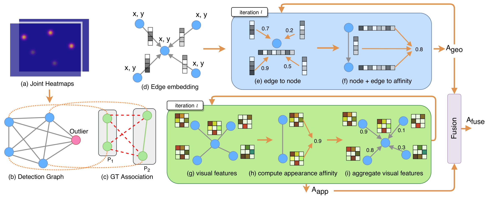

# Learning Spatial Context with Graph Neural Network for Multi-Person Pose Grouping



This repository includes the source code for our ICRA 2021 paper on bottom-up multi-person 2D pose estimation. Please read our paper for more details at [https://arxiv.org/abs/2104.02385](https://arxiv.org/abs/2104.02385).

Bibtex:

```
@inproceedings{lin2021learning,
    title={Learning Spatial Context with Graph Neural Network for Multi-Person Pose Grouping},
    author={Lin, Jiahao and Lee, Gim Hee},
    booktitle={ICRA},
    year={2021}
}
```

### Environment

Our code is tested on

* Python 3.7.10
* PyTorch 1.8.1 & torchvision 0.9.1
* CUDA 11.2

### Preparing Data

Before using the code in this repository, several sources of data need to be downloaded.

* Images and annotations from the [COCO Keypoints 2017](https://cocodataset.org) dataset
* [Cache data](https://drive.google.com/drive/folders/1G1oc0E8jo5zJ60H3EjcxRCulnIdzOkH3?usp=sharing) we generated to train our GNN model
* [Checkpoint](https://drive.google.com/drive/folders/1GfiyEzJPnRe-kkAfnjixFhhPmO1HMi6b?usp=sharing) of our pretrained GNN model
* [Checkpoint](https://drive.google.com/drive/folders/1pn24uLV3qzruOETgWIdcGzTgLd7Gr_hi?usp=sharing) and [results](https://drive.google.com/drive/folders/13yCtxzRQ24nnBkWX0LWKN5tQKXQmHkxz?usp=sharing) of Associative Embedding which our method builds upon

The downloaded data should be organized as follows:

```
    ROOTDIR/
        └── data/
            └── coco/
                └── annotations/
                    └── person_keypoints_train2017.json
                    └── person_keypoints_val2017.json
                    └── image_info_test-dev2017.json
                └── images/
                    └── train2017/
                    └── val2017/
                    └── test2017/
                └── cache/  => containing extracted visual features and generated graphs
                    └── train/
                        └── features.h5
                        └── graph_data.h5
                    └── valid/
                        └── features.h5
                        └── graph_data.h5
        └── detector/  => containing code from Associative Embedding for pose completion
            └── exp/
                └── checkpoint.pth.tar  => pretrained model of Associative Embedding
        └── exps/
            └── pretrained/
                └── ckpt/
                    └── ckpt_120.pth.tar  => our pretrained GNN model
        └── valid_multi.json  => results of Associative Embedding
        └── ...
```

### Pipeline

The pipeline of our method consists of the following steps:

* Generating keypoint detections and extracting corresponding visual features (cache data provided)
* Generating graph data (cache data provided)
* Inference with our GNN model and spectral clustering

```
    python inference.py --exp pretrained --epoch 120
```

* Complete missing keypoints using the code from Associative Embedding

```
    cd detector && python refine.py ../exps/pretrained/valid.json ../exps/pretrained/valid_complete.json && cd ..
```

* Evaluation

```
    python evaluate.py exps/pretrained/valid_complete.json exps/pretrained/valid_complete_final.json
```


### References

__Associative Embedding__: End-to-End Learning for Joint Detection and Grouping, Newell et al., NIPS 2017.
